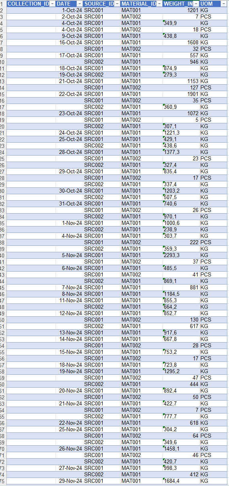

# Data Cleaning & Data Entry Simulation

## 📌 Description
This project focuses on cleaning raw data using Microsoft Excel. The dataset was processed by removing duplicates, correcting formats, and ensuring data accuracy.

## 🛠 Tools
- Microsoft Excel

## 🔧 Process
- Removed duplicates
- Fixed inconsistent formatting
- Standardized date format

## 💡 Result
The dataset became clean, structured, and ready for further analysis.

## 📷 Raw Data

## 📷 Cleaned Data

