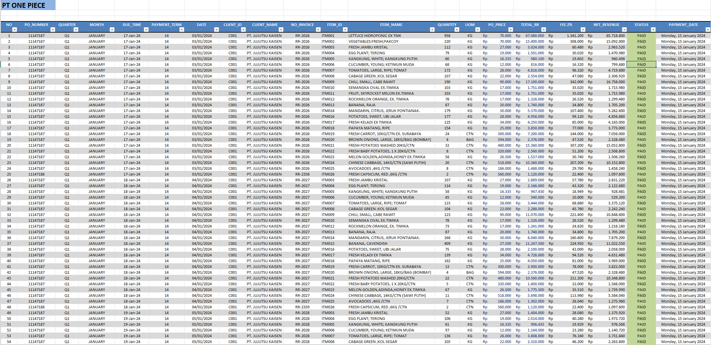

# Excel Sales Data Processing

## 📌 Description
This project demonstrates data processing and organization using Microsoft Excel. The dataset contains sales transaction records, including purchase orders, client information, product details, pricing, and payment status.

## 🛠 Tools
- Microsoft Excel

## 🔧 Process
- Data validation and checking consistency
- Formatting columns (date, currency, and text)
- Organizing structured tabular data
- Ensuring data accuracy for reporting

## 📊 Data Overview
The dataset includes the following key fields:
- PO Number
- Quarter & Month
- Due Time & Payment Term
- Client ID & Client Name
- Invoice Number
- Item ID & Item Name
- Quantity & Unit of Measure (UOM)
- Price and Total Revenue
- Fee and Net Revenue
- Payment Status & Payment Date

## 📷 Preview

## 💡 Key Outcome
- Data is structured and ready for analysis
- Improved readability and consistency
- Suitable for reporting and dashboard creation

## 📁 Files
- PROJECT1.xlsx
