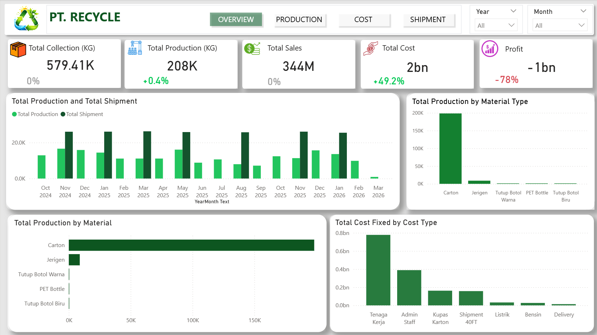

# Sales Data Analysis & Data Cleaning

## 📌 Description
This project includes both data cleaning and data analysis processes. Raw data was transformed into a clean dataset and used to build a sales dashboard.

## 🛠 Tools
- Microsoft Excel / Power BI

## 🔧 Data Cleaning
- Removed duplicates
- Fixed inconsistent data formats
- Handled missing values

## 📊 Analysis
- Monthly sales trends
- Top-performing products
- Regional performance

## 💡 Insights
- Certain months show higher sales performance
- Specific products contribute the most revenue

## 📁 Files
- 

## 📊 Dashboard

## 🚀 Conclusion
This project demonstrates my ability to transform raw data into structured datasets and generate meaningful insights through data analysis and visualization.
