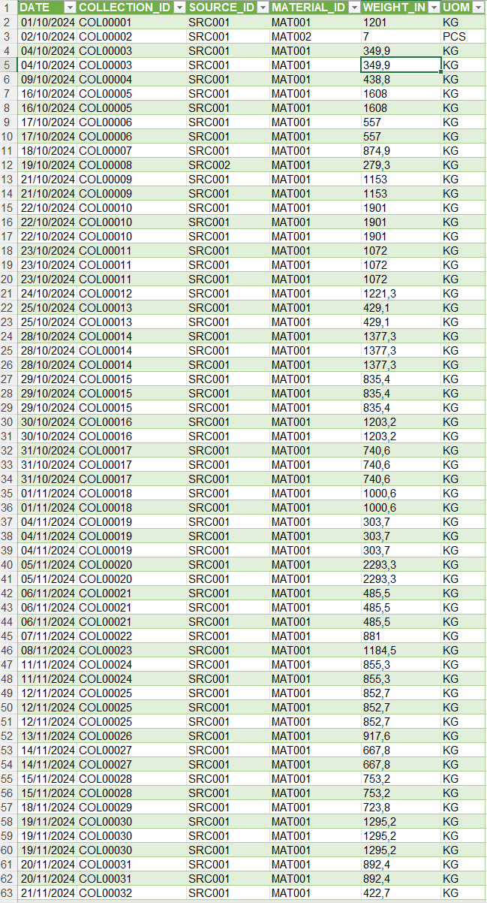

# Sales Data Analysis & Dashboard
## 📊 Business Case
This dashboard helps monitor operational performance, identify cost drivers, and evaluate profitability.

## 🚀 Project Overview
This project demonstrates an end-to-end data analysis process, starting from raw data cleaning to building an interactive dashboard using Excel and Power BI.

## 📌 Description
The dataset contains production, shipment, cost, and collection data. The raw data was cleaned, transformed, and used to generate insights through a dashboard.

## 🛠 Tools
- Microsoft Excel (Data Cleaning & Preparation)
- Power BI (Data Visualization & Dashboard)

## 🔧 Data Cleaning
- Removed duplicate records
- Standardized column formats (date, text, numeric)
- Organized structured tables
- Ensured consistency across datasets

## 📊 Analysis
- Total Collection and Production tracking
- Sales and Cost comparison
- Profit calculation
- Production trends over time
- Material type contribution analysis

## 💡 Key Insights
- Production and shipment show consistent trends across months
- Carton material dominates total production volume
- Costs significantly impact profit, leading to negative profit in some periods
- Operational costs such as labor and admin contribute the highest expenses

## 📷 Raw Data

## 📷 Cleaned Data

## 📊 Dashboard Overview

## 📁 Files
- PROJECT 2.xlsx
- Sales Dashboard.pbix

## 🚀 Conclusion
This project highlights the ability to transform raw operational data into meaningful insights and visualize them through an interactive dashboard to support business decision-making.
